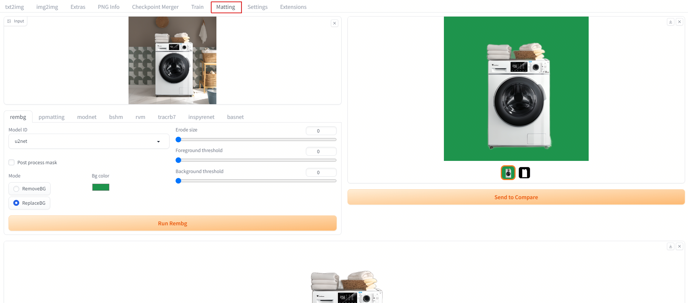

# Mattiing

Extension for [webui](https://github.com/AUTOMATIC1111/stable-diffusion-webui). 

Find the UI for Matting in the Extras tab after installing the extension.

# Installation

Install from webui's Extensions tab.

# Result comparsion

